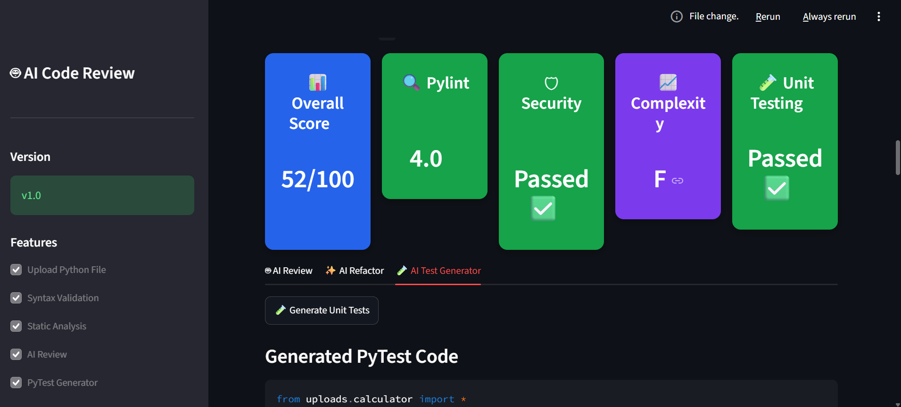

# 🤖 AI Code Review Assistant

<<<<<<< HEAD
An AI-powered Python Code Review Assistant built with **Streamlit** and **Google Gemini AI**. The application performs static code analysis, security scanning, AI-powered code review, AI refactoring, automatic PyTest generation, test execution, and PDF report generation through an interactive dashboard.
=======
An AI-powered **Python Code Review Assistant** built using **Streamlit** and **Google Gemini AI**. This application automates code analysis by performing syntax validation, static analysis, security scanning, complexity analysis, AI-powered code review, AI-based refactoring, PyTest generation, test execution, and professional PDF report generation through an interactive dashboard.
>>>>>>> 0949c7e (Added professional README)

---

## 🚀 Features

<<<<<<< HEAD
- 📂 Upload Python (.py) files
- ✅ Syntax Validation
- 🔍 Static Code Analysis using Pylint
- 🛡️ Security Scanning using Bandit
- 📈 Cyclomatic Complexity Analysis using Radon
- 🤖 AI Code Review using Gemini AI
- ✨ AI-Based Code Refactoring
- 🧪 AI-Generated PyTest Test Cases
- ▶️ Automatic PyTest Execution
- 📄 Professional PDF Report Generation
- 📊 Interactive Dashboard
=======
- 📂 Upload Python (.py) source files
- ✅ Syntax Validation
- 🔍 Static Code Analysis using **Pylint**
- 🛡️ Security Vulnerability Detection using **Bandit**
- 📈 Cyclomatic Complexity Analysis using **Radon**
- 🤖 AI-Powered Code Review using **Google Gemini AI**
- ✨ AI-Based Code Refactoring
- 🧪 AI-Generated PyTest Test Cases
- ▶️ Automatic PyTest Execution
- 📊 Interactive Dashboard with Quality Metrics
- 📄 Downloadable Professional PDF Report
>>>>>>> 0949c7e (Added professional README)

---

## 🛠️ Tech Stack

<<<<<<< HEAD
- Python
- Streamlit
- Google Gemini API
- Pylint
- Bandit
- Radon
- PyTest
- ReportLab
=======
| Category | Technologies |
|----------|--------------|
| Programming Language | Python |
| Frontend | Streamlit |
| AI Model | Google Gemini API |
| Static Analysis | Pylint |
| Security Analysis | Bandit |
| Complexity Analysis | Radon |
| Testing | PyTest |
| PDF Generation | ReportLab |
| Version Control | Git & GitHub |
>>>>>>> 0949c7e (Added professional README)

---

## 📂 Project Structure

```text
AI-Code-Review-Assistant/
<<<<<<< HEAD
│── app.py
│── uploads/
│── utils/
│── reports/
│── assets/
│── screenshots/
│── requirements.txt
│── README.md
=======
│
├── app.py
├── requirements.txt
├── README.md
│
├── assets/
│   └── styles.css
│
├── reports/
│
├── screenshots/
│   ├── home.png
│   ├── dashboard.png
│   ├── ai_review.png
│   └── pdf_report.png
│
├── uploads/
│   ├── __init__.py
│   └── calculator.py
│
└── utils/
    ├── ai_reviewer.py
    ├── dashboard.py
    ├── complexity_dashboard.py
    ├── constants.py
    ├── file_handler.py
    ├── pytest_runner.py
    ├── radon_helper.py
    ├── report_generator.py
    ├── score_helper.py
    ├── static_analysis.py
    └── syntax_checker.py
>>>>>>> 0949c7e (Added professional README)
```

---

<<<<<<< HEAD
## ⚙️ Installation

```bash
git clone https://github.com/Harshali2628/AI-Code-Review-Assistant.git

cd AI-Code-Review-Assistant

=======
# ⚙️ Installation

### Clone the Repository

```bash
git clone https://github.com/Harshali2628/AI-Code-Review-Assistant.git
```

### Navigate to the Project Folder

```bash
cd AI-Code-Review-Assistant
```

### Create a Virtual Environment

**Windows**

```bash
python -m venv venv
venv\Scripts\activate
```

**Linux / macOS**

```bash
python3 -m venv venv
source venv/bin/activate
```

### Install Dependencies

```bash
>>>>>>> 0949c7e (Added professional README)
pip install -r requirements.txt

<<<<<<< HEAD
=======
### Configure Gemini API

Create a `.env` file in the project root.

```env
GEMINI_API_KEY=YOUR_API_KEY
```

### Run the Application

```bash
>>>>>>> 0949c7e (Added professional README)
streamlit run app.py
```

---

<<<<<<< HEAD
## 📸 Screenshots

Add screenshots of:

- Home Page
- Dashboard
- AI Review
- PDF Report

Example:

```markdown





=======
# 📸 Screenshots

## 🏠 Home Page


---

## 📊 Dashboard


---

## 🤖 AI Review


---

## 📄 PDF Report


---

# 🔄 Workflow

```text
Upload Python File
        │
        ▼
Syntax Validation
        │
        ▼
Static Analysis (Pylint)
        │
        ▼
Security Scan (Bandit)
        │
        ▼
Complexity Analysis (Radon)
        │
        ▼
AI Code Review (Gemini)
        │
        ▼
AI Refactored Code
        │
        ▼
AI Unit Test Generation
        │
        ▼
Automatic PyTest Execution
        │
        ▼
Professional PDF Report
>>>>>>> 0949c7e (Added professional README)
```

---

<<<<<<< HEAD
## 📈 Future Enhancements

- Multi-language code support
- Docker Deployment
- GitHub Repository Integration
- CI/CD Integration
- Code Quality Trend Dashboard
- Team Collaboration Features

---

## 👩‍💻 Author

**Harshali Panchal**

GitHub: https://github.com/Harshali2628

LinkedIn: https://www.linkedin.com/in/harshali-panchal-771b6324a

---

## ⭐ If you like this project

Give this repository a ⭐ on GitHub.
=======
# 🎯 Key Highlights

- End-to-End AI-Powered Code Analysis
- Automated Security & Quality Assessment
- AI-Based Refactoring Suggestions
- Automatic Unit Test Generation
- Interactive Streamlit Dashboard
- Professional PDF Reporting
- ATS-Friendly Project Architecture

---

# 🚀 Future Enhancements

- Support for Java, C++, and JavaScript
- Docker Deployment
- GitHub Repository Integration
- CI/CD Pipeline
- Code Quality Trend Dashboard
- Multi-File Project Analysis
- User Authentication

---

# 👩‍💻 Author

**Harshali Panchal**

- GitHub: https://github.com/Harshali2628
- LinkedIn: *(Add your LinkedIn Profile URL)*

---

# ⭐ Support

If you found this project helpful, consider giving it a **⭐ Star** on GitHub.

>>>>>>> 0949c7e (Added professional README)
