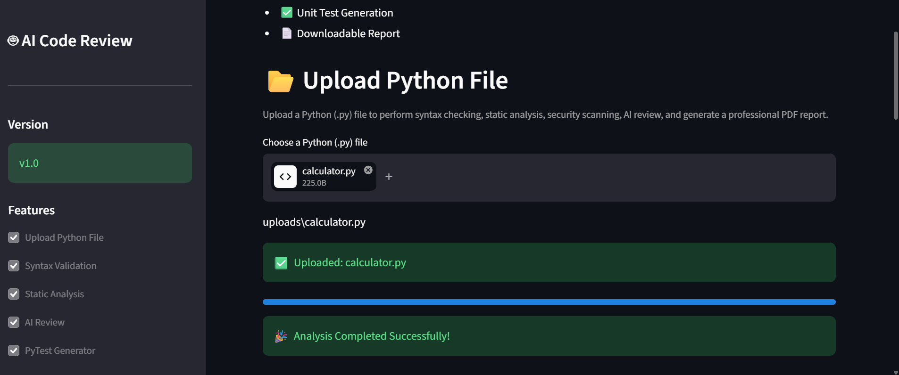

# 🤖 AI Code Review Assistant

An AI-powered Python Code Review Assistant built using **Streamlit** and **Google Gemini AI**. The application automates code analysis by performing syntax validation, static analysis, security scanning, complexity analysis, AI-powered code review, AI-based refactoring, automatic PyTest generation, test execution, and professional PDF report generation.

---

## 🚀 Features

- 📂 Upload Python (.py) source files
- ✅ Syntax Validation
- 🔍 Static Code Analysis using Pylint
- 🛡️ Security Scanning using Bandit
- 📈 Cyclomatic Complexity Analysis using Radon
- 🤖 AI Code Review using Google Gemini AI
- ✨ AI Code Refactoring
- 🧪 AI-Generated Unit Test Creation
- ▶️ Automatic PyTest Execution
- 📊 Interactive Dashboard
- 📄 PDF Report Generation

---

## 🛠️ Tech Stack

| Category | Technology |
|-----------|------------|
| Language | Python |
| Framework | Streamlit |
| AI Model | Google Gemini |
| Static Analysis | Pylint |
| Security | Bandit |
| Complexity | Radon |
| Testing | PyTest |
| PDF | ReportLab |
| Version Control | Git & GitHub |

---

## 📂 Project Structure

```text
AI-Code-Review-Assistant/
│
├── app.py
├── requirements.txt
├── README.md
│
├── assets/
├── reports/
├── screenshots/
├── uploads/
└── utils/
    ├── ai_reviewer.py
    ├── dashboard.py
    ├── pytest_runner.py
    ├── report_generator.py
    ├── score_helper.py
    ├── static_analysis.py
    └── syntax_checker.py
```

---

## ⚙️ Installation

### Clone Repository

```bash
git clone https://github.com/Harshali2628/AI-Code-Review-Assistant.git
```

### Open Folder

```bash
cd AI-Code-Review-Assistant
```

### Install Dependencies

```bash
pip install -r requirements.txt
```

### Add Gemini API Key

Create a `.env` file.

```env
GEMINI_API_KEY=YOUR_API_KEY
```

### Run the Project

```bash
streamlit run app.py
```

---

## 🐳 Docker

### Build

```bash
docker build -t ai-code-review-assistant .
```

### Run

```bash
docker run -p 8501:8501 --env-file .env ai-code-review-assistant
```
---

## 📸 Screenshots

### Home Page


### Dashboard


### Upload File



---

## 🔄 Workflow

```text
Upload Python File
        │
        ▼
Syntax Validation
        │
        ▼
Pylint Analysis
        │
        ▼
Bandit Security Scan
        │
        ▼
Radon Complexity Analysis
        │
        ▼
AI Code Review
        │
        ▼
AI Refactoring
        │
        ▼
AI Unit Test Generation
        │
        ▼
PyTest Execution
        │
        ▼
PDF Report Generation
```

---

## 🚀 Future Improvements

- 🔹 Support multiple programming languages such as Java, C++, JavaScript, and Go.
- 🔹 Integrate GitHub API to review pull requests and repositories directly.
- 🔹 Add CI/CD integration with GitHub Actions for automated code analysis.
- 🔹 Provide code quality trends and historical analytics through interactive dashboards.
- 🔹 Support multiple AI models (OpenAI, Claude, Llama, and Gemini) with model selection.
- 🔹 Implement user authentication and personalized review history.
- 🔹 Deploy the application on cloud platforms such as AWS, Azure, or Google Cloud.
- 🔹 Generate downloadable reports in multiple formats (PDF, HTML, and DOCX).
- 🔹 Add team collaboration features with comments and review sharing.
- 🔹 Improve performance using asynchronous processing for large codebases.

---

## 👩‍💻 Author

**Harshali Panchal**

- GitHub: https://github.com/Harshali2628
- LinkedIn: https://www.linkedin.com/in/harshali-panchal-771b6324a

---

## ⭐ Support

If you found this project useful, please consider giving it a ⭐ on GitHub.
