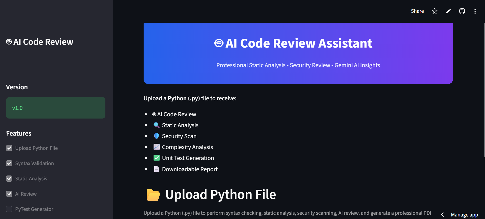
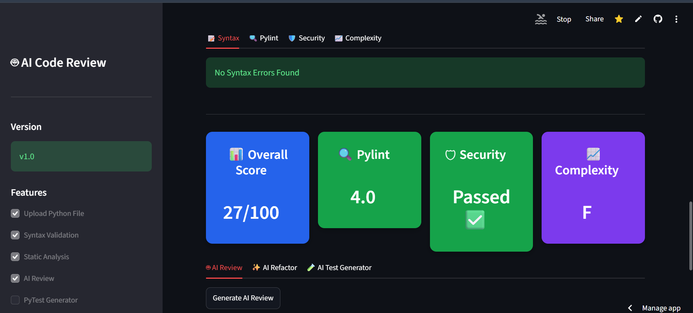
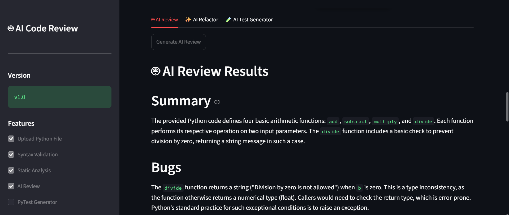
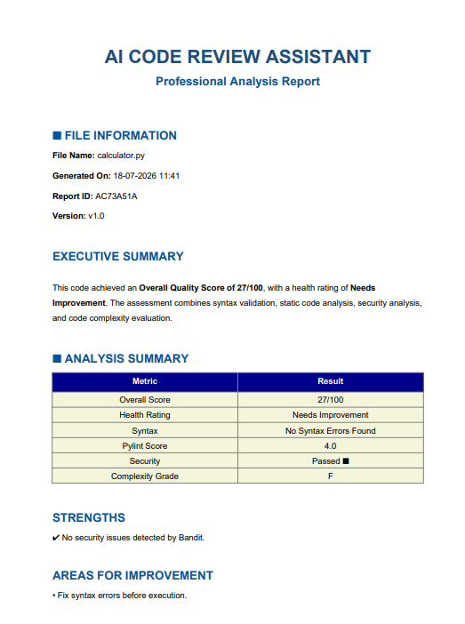

## 🔗 Links

- **Live Demo:** https://ai-code-review-assistant-7dwvew6j4ebfvk8mb6avhb.streamlit.app/
- **GitHub Repository:** https://github.com/Harshali2628/AI-Code-Review-Assistant

# 🤖 AI Code Review Assistant

An AI-powered code review application that analyzes Python code using static analysis tools and Gemini AI. The application provides code quality insights, security analysis, complexity metrics, AI-generated reviews, refactored code suggestions, and downloadable PDF reports.

## 🚀 Features

- ✅ Python Syntax Validation
- ✅ Code Quality Analysis using Pylint
- ✅ Security Analysis using Bandit
- ✅ Code Complexity Analysis using Radon
- ✅ AI-Powered Code Review (Gemini)
- ✅ AI Refactored Code Suggestions
- ✅ AI Test Case Generation
- ✅ Overall Code Quality Score
- ✅ Downloadable PDF Report
- ✅ Interactive Streamlit Dashboard

## 📸 Application Screenshots

### 🏠 Home Page

A modern and intuitive landing page showcasing the AI Code Review Assistant with an overview of supported features and an easy-to-use interface.



---

### 📊 Code Analysis Dashboard

Comprehensive dashboard displaying code quality metrics, security scan results, complexity analysis, and the overall code quality score generated using Pylint, Bandit, and Radon.



---

### 🤖 AI Code Review

AI-powered review generated using **Gemini AI**, providing code improvement suggestions, best practices, and refactored code recommendations to enhance code quality.



---

### 📄 Downloadable PDF Report

Generate and download a professional PDF report containing code analysis results, AI insights, security findings, and actionable recommendations.



## 🛠️ Tech Stack

- Python
- Streamlit
- Google Gemini API
- Pylint
- Bandit
- Radon
- ReportLab
- HTML/CSS

## 📂 Project Structure

```
AI-Code-Review-Assistant/
│── app.py
│── requirements.txt
│── README.md
│── assets/
│── utils/
│── sample_codes/
```

## ⚙️ Installation

```bash
git clone https://github.com/Harshali2628/AI-Code-Review-Assistant.git
cd AI-Code-Review-Assistant
pip install -r requirements.txt
```

Create a `.env` file:

```
GEMINI_API_KEY=YOUR_API_KEY
```

Run the application:

```bash
streamlit run app.py
```

## 📊 Output

The application generates:

- Code Quality Report
- Security Report
- Complexity Analysis
- AI Review
- Refactored Code
- Test Cases
- PDF Report

## 👩‍💻 Author

**Harshali Panchal**

Final Year CSE (AI & ML)
VIT Bhopal University
