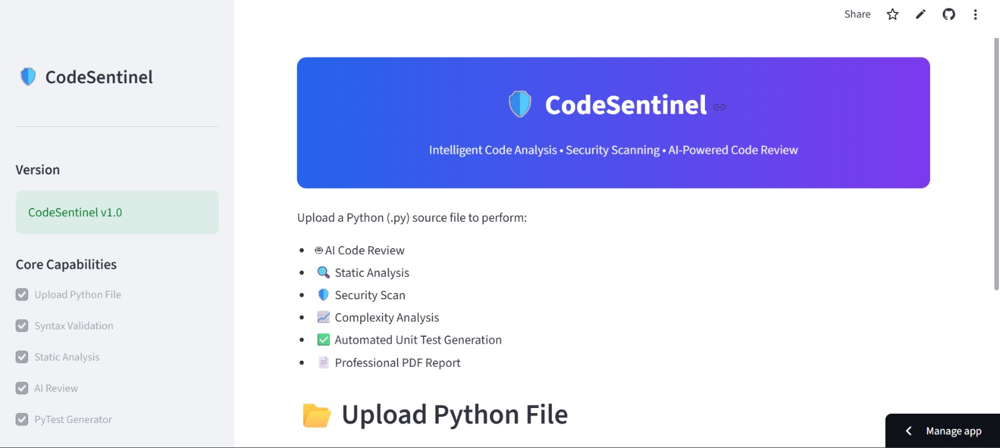
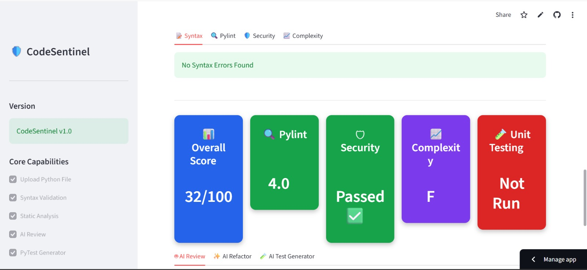
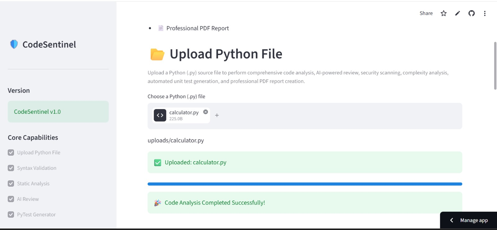

# 🤖 AI Code Review Assistant


An AI-powered Python Code Review Assistant built using **Streamlit** and **Google Gemini AI**, with the AI review logic also exposed via a standalone **FastAPI REST API**. The application automates code analysis by performing syntax validation, static analysis, security scanning, complexity analysis, AI-powered code review, AI-based refactoring, automatic PyTest generation, test execution, and professional PDF report generation, all wrapped in an interactive **Streamlit** dashboard.

---

## 🚀 Live Demo

🔗 [https://ai-code-review-assistant-7dwvew6j4ebfvk8mb6avhb.streamlit.app/]

---

## 🚀 Features

- 📂 Upload Python (.py) source files
- ✅ Syntax Validation
- 🔍 Static Code Analysis using Pylint
- 🛡️ Security Scanning using Bandit
- 📈 Cyclomatic Complexity Analysis using Radon
- 🤖 AI Code Review using Google Gemini AI
- ✨ AI Code Refactoring
- 🧪 AI-Generated Unit Test Creation
- ▶️ Automatic PyTest Execution
- 📊 Interactive Dashboard
- 📄 PDF Report Generation
- ⚡ **FastAPI REST API** (`api.py`) exposing the Gemini AI code review as a standalone `/review` endpoint
- 📑 Auto-generated **Swagger / OpenAPI docs** (`/docs`) for the API
- 🐳 Docker support for containerized deployment of both API and UI
- 📁 Python file upload support
- 📈 Interactive Streamlit dashboard

---

## 🛠️ Tech Stack

| Category | Technology |
|-----------|------------|
| Language | Python |
| Backend / API | **FastAPI**, Uvicorn |
| Frontend | Streamlit |
| AI Model | Google Gemini |
| Static Analysis | Pylint |
| Security | Bandit |
| Complexity | Radon |
| Testing | PyTest |
| PDF | ReportLab |
| Containerization | Docker |
| Version Control | Git & GitHub |

---

## 📂 Project Structure

```text
AI-Code-Review-Assistant/
│
├── app.py                  # Streamlit frontend
├── api.py                  # FastAPI app (uvicorn entrypoint)
├── Dockerfile
├── .dockerignore
├── requirements.txt
├── README.md
├── LICENSE
│
├── assets/
├── reports/
├── screenshots/
├── uploads/
│
└── utils/
    ├── ai_reviewer.py
    ├── dashboard.py
    ├── pytest_runner.py
    ├── report_generator.py
    ├── score_helper.py
    ├── static_analysis.py
    └── syntax_checker.py
```

---

## ⚡ FastAPI Integration

The AI code review logic is exposed as a lightweight **FastAPI REST API** (`api.py`), built on top of the existing `review_code()` function from `utils/ai_reviewer.py`. This lets the Gemini-powered review be triggered independently of the Streamlit UI — via `curl`, Postman, or any other client.

### Key Endpoints

| Method | Endpoint | Description |
|--------|----------|--------------|
| `GET`  | `/` | Root endpoint — confirms the API is running |
| `GET`  | `/health` | Health check endpoint |
| `POST` | `/review` | Accepts a code string and returns an AI-generated review (Gemini AI) |
| `GET`  | `/docs` | Interactive Swagger UI (auto-generated by FastAPI) |

### Run the FastAPI Server

```bash
uvicorn api:app --reload --host 0.0.0.0 --port 8000
```

Once running, visit:

- Swagger UI → `http://localhost:8000/docs`
- ReDoc → `http://localhost:8000/redoc`

### Example Request

```bash
curl -X POST "http://localhost:8000/review" \
  -H "Content-Type: application/json" \
  -d '{"code": "def add(a, b):\n    return a + b"}'
```

### Example Response

```json
{
  "review": "The function is simple and correct. Consider adding type hints and a docstring for clarity."
}
```

---

## ⚙️ Installation

### Clone Repository

```bash
git clone https://github.com/Harshali2628/AI-Code-Review-Assistant.git
```

### Open Folder

```bash
cd AI-Code-Review-Assistant
```

### Install Dependencies

```bash
pip install -r requirements.txt
```

### Add Gemini API Key

Create a `.env` file.

```env
GEMINI_API_KEY=YOUR_API_KEY
```

### Run the Project

Start the **FastAPI backend**:

```bash
uvicorn api:app --reload
```

In a separate terminal, start the **Streamlit frontend**:

```bash
streamlit run app.py
```

---

## 🐳 Docker

### Build

```bash
docker build -t ai-code-review-assistant .
```

### Run (Streamlit UI)

```bash
docker run -p 8501:8501 --env-file .env ai-code-review-assistant
```

### Run (FastAPI backend)

```bash
docker run -p 8000:8000 --env-file .env ai-code-review-assistant uvicorn api:app --host 0.0.0.0 --port 8000
```

> 💡 For local development, you can also run both services together using `docker-compose` if a `docker-compose.yml` is added to the project.

---

## 📸 Screenshots

### Home Page



### Dashboard



### Upload File



---

## 🏗️ System Architecture

```text
                          ┌─────────────────────┐
                          │       User          │
                          └──────────┬──────────┘
                                     │
                     ┌───────────────┴───────────────┐
                     ▼                                ▼
        ┌────────────────────────┐        ┌────────────────────────┐
        │     Streamlit UI       │        │   External API Client   │
        │ (File Upload & Inputs) │        │  (curl / Postman / etc) │
        └──────────┬──────────────┘        └───────────┬─────────────┘
                   │                                    │
                   │  (direct function calls)           │  HTTP POST /review
                   ▼                                    ▼
   ┌─────────────────┐    ┌──────────────────┐   ┌──────────────────┐
   │ Syntax Checker  │    │ Static Analysis  │   │  FastAPI (api.py) │
   │                 │    │ • Pylint         │   │  → review_code()  │
   │                 │    │ • Bandit         │   │  → Gemini AI      │
   │                 │    │ • Radon          │   │                  │
   └────────┬────────┘    └────────┬─────────┘   └────────┬─────────┘
            │                      │                      │
            └──────────────────────┼──────────────────────┘
                                   ▼
                   ┌────────────────────────────┐
                   │   Score & Report Generator │
                   │  • Quality Score           │
                   │  • Security Score          │
                   │  • Complexity Score        │
                   │  • PDF Report              │
                   └─────────────┬──────────────┘
                                 ▼
                  ┌─────────────────────────────┐
                  │ Interactive Dashboard       │
                  │ • Metrics                   │
                  │ • Charts                    │
                  │ • Download PDF Report       │
                  └─────────────────────────────┘
```

### Workflow

1. The user uploads a Python source code file through the Streamlit interface (syntax checking, static analysis, security scanning, and complexity analysis run directly within the app).
2. In parallel, the **FastAPI service** (`api.py`) exposes the Gemini-powered `review_code()` function as a standalone `/review` endpoint, so any external client can request an AI code review over HTTP.
3. Google Gemini AI generates an intelligent code review with suggestions and improvements.
4. The Streamlit app combines the static analysis results and AI review to calculate quality metrics and generate a PDF report.
5. The interactive dashboard displays the results and allows users to download the generated report.

> 📝 Currently only the `/review` endpoint is implemented in the API. The other analysis steps (syntax check, Pylint, Bandit, Radon, PDF report) run inside the Streamlit app directly. They can be exposed as additional FastAPI endpoints later — see **Future Improvements** below.

---

## 🚀 Future Improvements

- 🔹 Support multiple programming languages such as Java, C++, JavaScript, and Go.
- 🔹 Integrate GitHub API to review pull requests and repositories directly.
- 🔹 Add CI/CD integration with GitHub Actions for automated code analysis.
- 🔹 Provide code quality trends and historical analytics through interactive dashboards.
- 🔹 Support multiple AI models (OpenAI, Claude, Llama, and Gemini) with model selection.
- 🔹 Expand the FastAPI service with additional endpoints for static analysis, security scanning, complexity analysis, and PDF report generation.
- 🔹 Implement user authentication and personalized review history (via FastAPI JWT auth).
- 🔹 Add rate limiting and API key management for public FastAPI endpoints.
- 🔹 Deploy the application on cloud platforms such as AWS, Azure, or Google Cloud.
- 🔹 Generate downloadable reports in multiple formats (PDF, HTML, and DOCX).
- 🔹 Add team collaboration features with comments and review sharing.
- 🔹 Improve performance using asynchronous processing (FastAPI async endpoints) for large codebases.

---

## 👩‍💻 Author

**Harshali Panchal**

- GitHub: https://github.com/Harshali2628
- LinkedIn: https://www.linkedin.com/in/harshali-panchal-771b6324a

---

## ⭐ Support

If you found this project useful, please consider giving it a ⭐ on GitHub.
